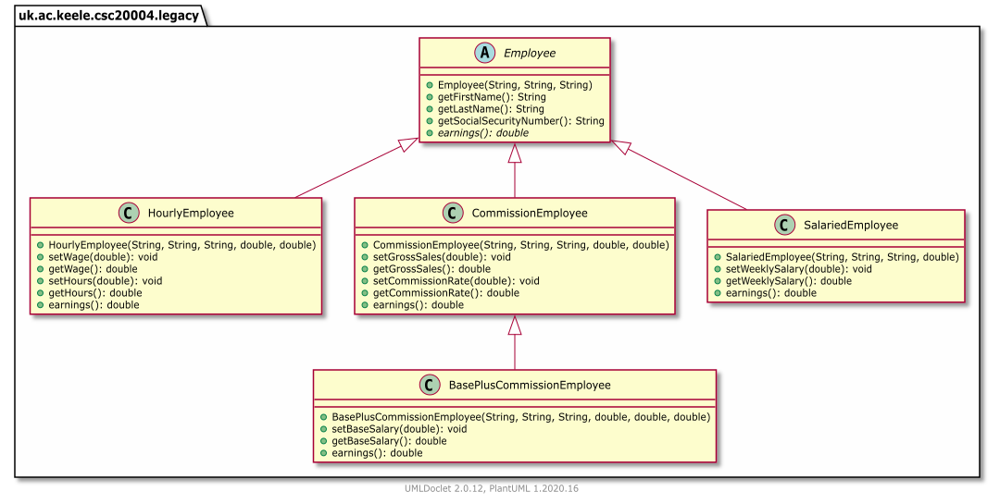

# Practical1: Working with legacy code

This repository contains some support code for Practical 1.

The source code adapted from: Deitel, Deitel. [Java How to Program, 11/e, Early Objects Version](https://github.com/pdeitel/JavaHowToProgram11e_EarlyObjects)

A description of the code, with a review of the main concepts for OOP is in Chpater 10 of the book: "Object-oriented programming: polymorphism and interfaces". A digitised compy of the chapter is avavilable on line in the reading list of the module.

We assume here that we have some existing code implementing a hierarchy of classes for managing employees, with different types of contracts.
Those existing classes are in the `legacy` package, and the following UML diagram shows their hierarchy:
